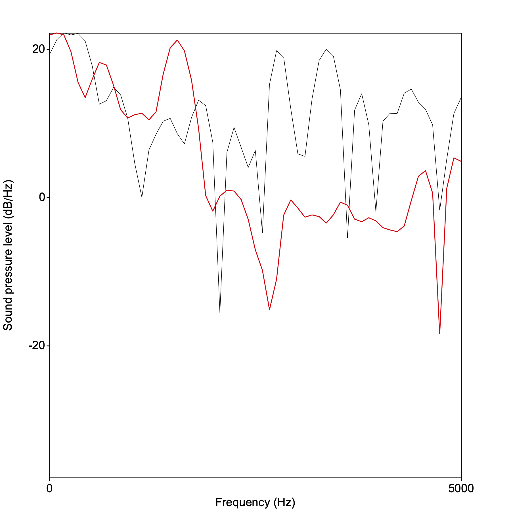
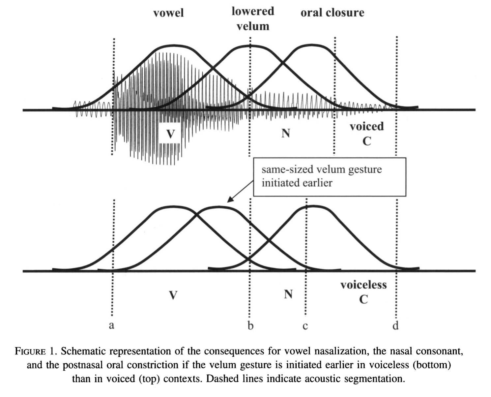
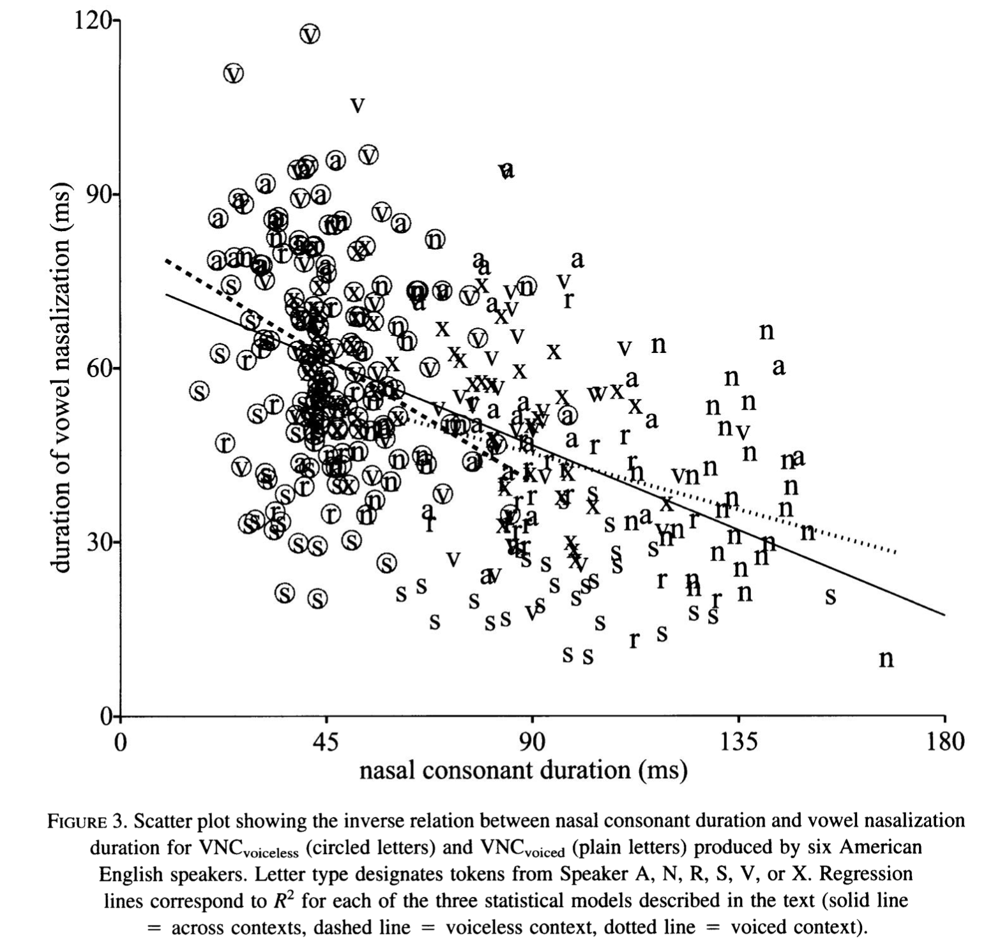

<style type="text/css">
  body{
  font-size: 12pt;
}
</style>

```{r setup, include=FALSE}
knitr::opts_chunk$set(echo = TRUE)
knitr::opts_chunk$set(dev = "png",
                      dpi = 600,
                      echo = FALSE,
                      cache = FALSE)
options(repos = list(CRAN="http://cran.rstudio.com/"))
install.packages('tidyverse') 
library(tidyverse)
```

# Variation $\rightarrow$ sound change

Beddor's paper follows in a long tradition (beginning with some 19th C. philologists like de Courtenay and Passy) of thinkers about language who identify the seeds of sound change in natural variation that arises in certain phonological environments. Perhaps the most famous of these ideas was developed by John Ohala (my first phonetics teacher). Ohala located one of the sources of sound change in the listener. Read [this](papers/ohala1981.pdf) for details.

The Beddor paper is a *position paper* in that it proposes that sound change can happen as a result of two factors located in (synchronic) articulation, acoustics, and perception:

1. Coarticulation resulting in a temporal covariation between source and recipient articulations and acoustics (effect)
2. Perceptual equivalence between the source and the effect

Not only does the source sound *bleed* into the adjacent sound, but some aspect of that source is treated as perceptually "the same" by the listener. 

# Coarticulation

Coarticulation refers to the overlap in articulatory gestures, either locally or at a distance. Why does this happen? It reveals the nature of our phonological organization that "downstream" phones begin to be articulated in their anticipation, provided they don't have phonetically deleterious consequences. Our perceptual system is very good at factoring out coarticulatory information. BUT, Ohala proposes that there might be times when the coarticulatory information is **not** factored out and the acoustic effect of the source is not properly attributed. For example, when you hear an English speaker say "kit", the velar stop is actually articulated more front in the mouth than when preceding other vowels, yet we still hear it as a "k." Try slowly articulating "kit" and "cot". Below are the [k] portions from both:


And the corresponding wide-band spectra taken at the center of the aspiration noise:

<p align="center">
  
</p>
The red line (envelope) is the back vowel in "cot" and the black line is "kit." Notice that the energy in "cot" is high in the lower band of the spectrum, reflecting the larger oral cavity for the [k] when it is in the back vowel position, or in anticipation of the back vowel in "cot."

The result of misattributing the effect of the source (in the "kit"/"cot" case) would be the listener interpreting the two [k]s as being different. This would be a *mini sound-change." BUT, coarticulation is ultimately informative and supports listeners' perception of the source...so how can it be both infomative and potentially misleading (leading to mini sound changes which can ultimately result in a major sound change)? \$right arrow$ this is the question Beddor asks. She concludes that indeed, coarticulation can both be informative as well as serve as the mechanism for certain sound changes.

# ṼN $\rightarrow$ Ṽ

Anticipatory vowel nasalization occurs when the velum begins lowering during vowel production in anticipation of the following nasal consonant. Recall that this results in coupling between the oral and nasal cavities, decreasing the amplitude difference between A1 and P0. Historically, ṼN has resulted in Ṽ in languages like French, where the nasal consonant disappears, with nasality remaining on the vowel. Beddor hypothesized that there is a stage in this history where the duration of the source (nasal murmur) is inversely related to the duration of vowel nasalization. In languages (like English) which does not have contrastive vowel nasalization, the prediction is that the "nasal gesture" (lowered velum) is stable but aligned with the vowel and post-vowel consonant variably. 

Beddor is looking at how the nasal gesture is assigned variably by speaker in VNC contexts and how it systematically related to the voicing feature of the C. It had been reported in previous literature that vowels are more nasalized with accompanying shorter nasal consonants in English and other languages. 

<p align="center">
  
</p>
\

# The experiment

Only 9 speakers(!), and only 6 for the data analysis reading a word list with multiple repetitions of C(C)V(N)C words like *bet, bent, bed, bend* in a carrier phrase "Say ___ quickly." Beddor examines the extent of nasalization (percentage of the vowel) relative to the duration of the nasal consonant.

<p align="center">
  
</p>

But, there is also tons of variation between speakers. For some speakers, the relationship netween N duration and V nasalization disappears when the following C is voiceless. 

Let's look at some VNC tokens and see if there is this sort of velar gesture consistency in my productions of "bed", "bend", "bet", "bent".

Download [here](sounds/bed_bend.wav)

