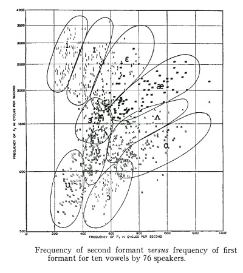
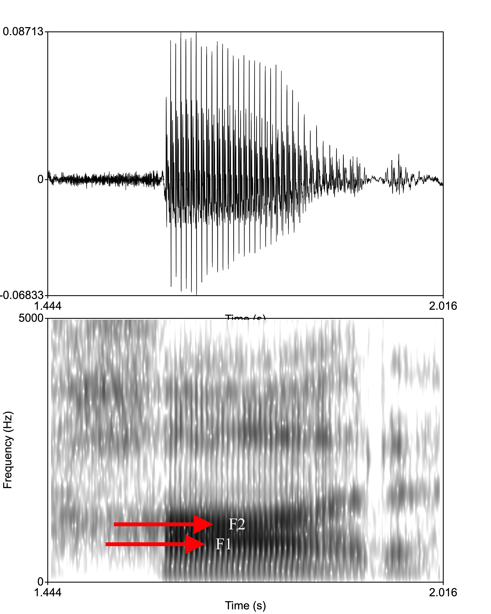
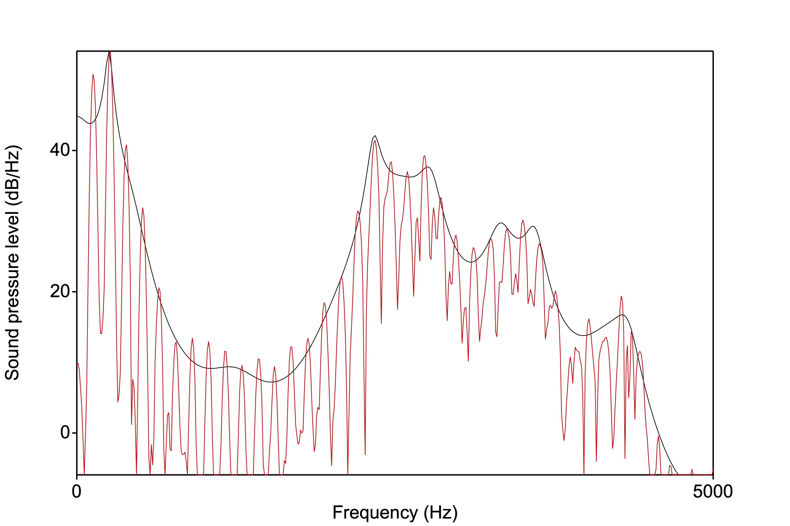

<style type="text/css">
  body{
  font-size: 12pt;
}
</style>

```{r setup, include=FALSE}
knitr::opts_chunk$set(echo = TRUE)
knitr::opts_chunk$set(dev = "png",
                      dpi = 600,
                      echo = FALSE,
                      cache = FALSE)
options(repos = list(CRAN="http://cran.rstudio.com/"))
install.packages('tidyverse') 
library(tidyverse)
```

# Hillenbrand, Getty, Clark, and Wheeler (1995)

This paper (is now old) but was pretty influential at the time because it aimed to replicate a (much) earlier paper by [Peterson](images/gordon-peterson.jpeg) and Barney (1952) that exemplified one of the *problems of speech perception*, namely that phonological object (in this case a vowel) can have multiple acoustic realizations both within and between speakers (of varying age and gender). P&B recorded and analyzed canonical American English vowels produced in h-V-d contexts as produced by men, women, and children. The resulting image has been used in countless descriptions of the complexity of vowel spaces:

<p align="center">
  
</p>

Hillbrand attempts to revisit P&B. Note that Hillenbrand is in central Michigan, which is quite different from the data P&B collected near the Bell Laboratories in New Jersey.

## P&B's measurements
- F1-F3 (Hz)
- F1-F3 (amplitude)
- F0

All measurements made from the "steady state" portion of the vowel. Why? $\rightarrow$ The middle section of a vowel is thought to be least affected by neighbouring segments (i.e., least coarticulation).

Let's do a quick exercise examining vowels and variability. Download the following three .wav files. Each has a list of hVd words in a carrier sentence. The vowels are: "hawed," "heed," "hood" (/u/ vowel), "had," "head," and "hud."

[hVd1](sounds/hvd1.wav)
[hvd2](sounds/hvd2.wav)
[hvd3](sounds/hvd3.wav)

Cut up these files and make vowel midpoint measurements (F1 and F2) for the target sounds. Then input your measurements into an Excel document and then save it as a .csv file to be read into R. 

<p align="center">
  
</p>

Here are my measurements of F1, F2 at the vowel midpoints $\rightarrow$ [data](hvd_data.csv)

```{r echo=FALSE}
hvd <- read_csv('hvd_data.csv')
hvd
```

Now we can plot a rudimentary **scatterplot** of these data:

```{r echo=TRUE}
ggplot(hvd, aes(x=F2, y=F1, label = vowel)) + geom_text() + scale_x_reverse() + scale_y_reverse()
```

Can we look at the data in any other way? How about boxplots? A boxplot shows mean values of each group with some variance statistics (error bars, quartile ranges, etc.). It might be not very useful for the present data but let's try it nonetheless.

```{r echo=TRUE}
ggplot(hvd, aes(vowel, F2-F1)) + geom_boxplot()
```

# LPC

Hillenbrand et al. use **LPC** analysis to analyze the formants in their data. There are plenty of descriptions of what LPC (linear predictive coding) is so we won't go down that road. It's safe to say that LPC approximates the formant peaks without the source characteristics. Remember that our model of vowel acoustics is based on *source-filter theory*, with the source spectrum (fundamental frequency and higher order harmonics that are related to the F0) provided by the glottal oscillation and the filter being the resonant characteristics of the tubes making up the pharynx and oral cavity. LPC, through a lot of fancy math digital signal processing, figures out what the formants are based on adjacent samples. 

Let's do an LPC analysis in Praat and compare it to the FFT that we're used to. As a rule of thumb, we expect 1 formant every 1000Hz, so based on the sample rate of the file. First resample your file at a lower rate (try 10 or 11kHz).

- Sound > Convert > Resample
- Go to the midpoint of the vowel you want to analyze
- Analyze Spectrum > To LPC (autocorrelation)
- Prediction order is important! The sampling rate is 10000Hz (say), so we would expect 10 formants. Multiply the number of expected formants x 2, then add 2. So (10 x 2) + 2 = 22
- From the LPC object > To Spectrum (slice) > use the time from the middle of the vowel

In the image below you can see the consistency between the LPC peaks (black) and the FFT harmonics (red, the loudest peaks are the formants):

<p align="center">
  
</p>


# Assignment 1

You can download Assignment 1 [here](docs/LAL6120_Assignment1.pdf). You'll need some way to record your voice onto your computer so that you can analyze in Praat and then make some plots in R. 