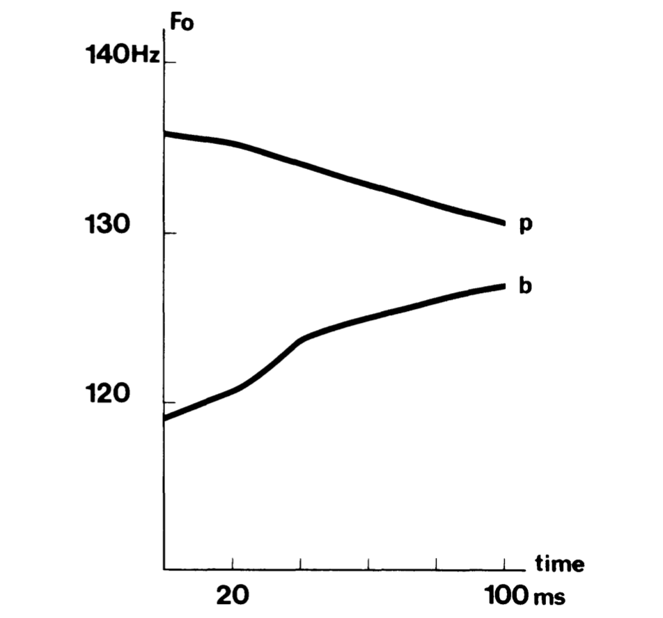
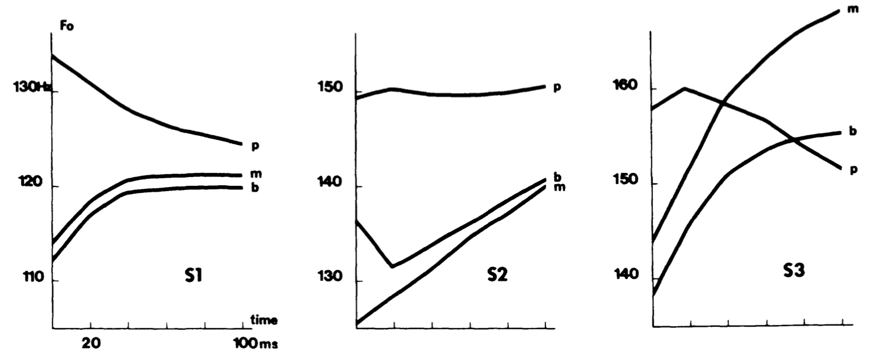
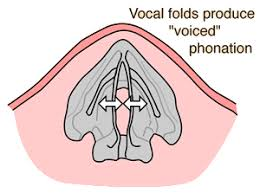
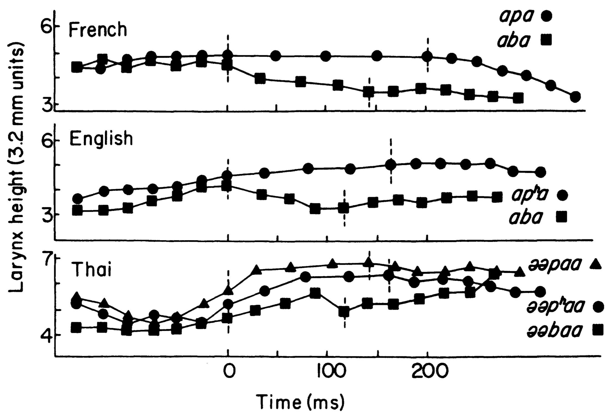

<style type="text/css">
  body{
  font-size: 12pt;
}
</style>

```{r setup, include=FALSE}
knitr::opts_chunk$set(echo = TRUE)
knitr::opts_chunk$set(dev = "png",
                      dpi = 600,
                      echo = FALSE,
                      cache = FALSE)
options(repos = list(CRAN="http://cran.rstudio.com/"))
install.packages('tidyverse') 
library(tidyverse)
```

# "Intrinsic perturbation used extrinsically"

This is a rather "classic" paper on the birth of tone, or "tonogenesis." In the history of many languages which previously had stop voicing contrasts (in syllable onset position), tone develops when the contrast is lost. Typically previously voiced stops develop into low tone, and voiceless into high tone. The authors suggest that this type of change reflects an "intrinsic perturbation used extrinsically." Keeping with Ohala's theory of a listener-based sound change process, the listener potentially misattributes the natural perturbation of the fundamental frequency associated with voicing to the vowel fundamental frequency itself. 
The entirety of the paper presents various theories as to why pitch is perturbed in voicing conditions. In CVs, if C is voiced, the following vowel's F0 is lower than when C is voiceless. 

<p align="center">
  
</p>
\

How do we account for this in terms of the articulatory mechanics of voicing? The authors present two hypotheses.

# Aerodynamic hypothesis

The aerodynamic hypothesis is perhaps the most common account. During voiced stop closure, oral pressure gradually builds up [behind the occlusion] $\rightarrow$ this has the effect of decreasing the pressure drop across the vocal cords (the pressure differential is less than if there is no occlusion). 

>Recall that for voicing to occur subglottal pressure HAS to be higher than oral pressure. The movement of air across the vocal folds that occurs as a result of the differential causes them to oscillate.

The resulting decrease in pressure drop has the effect of slowing down (or lowering) the F0. When the occlusion is released, then the oral pressure falls to atmospheric pressure and the subglottal pressure is high again, resulting in higher F0 for the vowel. 

So the predicted F0 following voiced stop would be low (small pressure differential) to higher (normal voicing). SO, the perturbation is prected to only last during the initial portion of the vowel. But this is not what is observed in laboratory experiments. 

<p align="center">
  
</p>
\

It looks like the perturbtation extends throught the vowel, or at least the first 100ms in one data set. SO what is happening? There are competing theories as to why F0 after voiced stops is low. 

# Vocal-cord tension hypothesis

There are two versions of this hypothesis, both relating to the tension across the vocal folds, but either in horizontal or vertical positions:

1. Horizontal tension (Halle and Stevens, 1971): When making the voiced-voiceless disctinction the vocal cords are in different positions/tensions. These different positions are affected by horizontal tension. The horizontal tension is slack when voicing, and taut to prevent voicing for voiceless stops. These vocal fold states essentially bleed into the adjacent vowel affecting the F0. Apparently Halle and Stevens claim that this should occur in postvocalic Cs as well, and this makes sense if the vocal folds start to slacken in anticipation of the voicing of the stop.

<p align="center">
  
</p>
\

2. Vertical tension (Ohala, Ewan, Stevens): This is essentially the same as the horizontal tension hypothesis, but makes different claims regarding the nature of preconsonantal vowel F0. I struggle to understand how the vertical tension hypothesis's claim is functionally different from the horizontal tension claim as the paper doesn't really clearly present it. But rather the paper presents lots of evidence for why we should *not* expect post-vocalic Cs to affect the F0 of the preceding vowel. The vertical tension hypothesis is supported by proxy evidence from larynx height. The vertical position of the larynx (measured using a thyroumbrometer) differs in voiced vs. voiceless stops. 

<p align="center">
  
</p>
\

# Measuring pitch perturbation

Download this [file](sounds/pitiki.wav)

We'll look at how to examine fundamental frequency, how to print pitch tracks (a ala Hombert), etc.

# R

Let's try to make a plot that compares one dichotomous variable against a continuous variable and make one for each group. First read in some data. We'll use the built-in data set called 'mtcars'. But you will use your own data from the pitch exercise.

```{r echo=TRUE}
data(mtcars) #Read in the data file
head(mtcars, 10) #print the first 10 lines
```

Let's plot gear (3 vs. 4) by mpg (continuous) and make a panel for each Cylinder:

```{r echo=TRUE}
mtcars$gear <- as.factor(mtcars$gear)
basic <- ggplot(mtcars, aes(x=gear, y=mpg, group=gear)) +
  geom_boxplot(aes(fill=gear))
basic
```

Now lets split this up for each cyl (4, 6, 8):

```{r echo=TRUE}
basic + facet_grid(. ~ cyl)
```