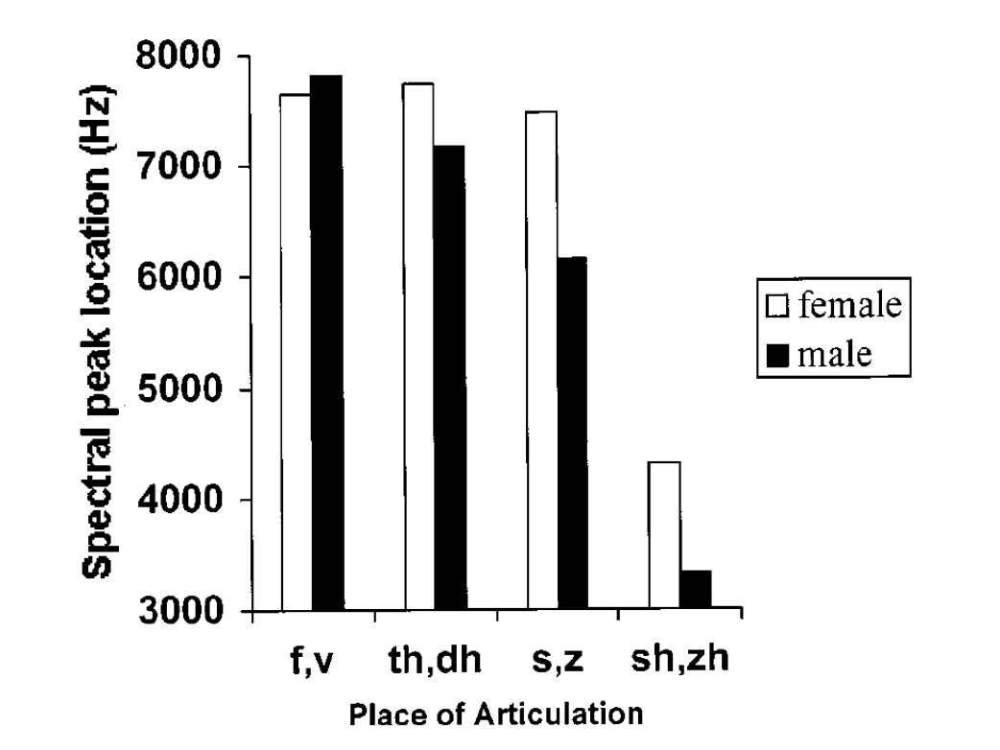

<style type="text/css">
  body{
  font-size: 12pt;
}
</style>

```{r setup, include=FALSE}
knitr::opts_chunk$set(echo = TRUE)
knitr::opts_chunk$set(dev = "png",
                      dpi = 600,
                      echo = FALSE,
                      cache = FALSE)
options(repos = list(CRAN="http://cran.rstudio.com/"))
install.packages('tidyverse') 
library(tidyverse)
```

# Fricatives

Fricatives are produced when high-pressure air in the (generally) oral cavity is released through a small aperture. The cross-sectional area of the opening and where in the mouth the opening is located both contribute to the spectral shape. The shape has a natural *center of gravity*, which reflects the resonance of the volume anterior (in front of) the constriction aperture. 

The overall *definition* of the spectral shape is determined by the length of the anterior volume, but more importantly the location of the spectral peak:

<p align="center">
  
</p>

If we look at the results here, they have conducted a four-way *analysis of variance*, which compares mean values, that is, the individual measurements are averaged and then the analysis is run. The ANOVA is an extension of a *t-test* which checks whether **two** means are significantly different. When there are more than two groups (like the places of articulation for fricatives in Jongman) we use ANOVA. I encourage you to read-up on ANOVA as you'll see it *a lot* in older phonetics studies. [This](https://www.youtube.com/watch?v=0NwA9xxxtHw) is a nice explanation.

We can clearly see that there is an effect of place of articulation (POA) on spectral peak, which decreases the further back in the mouth the constriction is. So palatal fricatives have the lowest spectral peak, which makes sense aerodynamically as with the back constriction there is a large resonating cavity in front. The longer the cavity (often modeled as a tube), the lower the resonance. If the front cavity is modeled as a tube that's open on both ends, then it's what is called a "half-wave" resonator and the resonances are described by:
$$F_n = \frac{nv}{2L}$$

With *L* in the denominator being the length of the tube, it's clear that as it gets longer, the frequency of the loudest resonance decreases.

## Acoustic salience

Notice that the two dental fricatives (f, th) are *very* similar in their spectral peak locations (~8kHz) and nearly identical in their spectral means. The overall similarity between the two is reflected in some sound changes (th~f in some dialects of English) as well as patterns in infant speech perception. Young infants are thought to be able to discriminate contrasts from both native and non-native sound systems, yet this contrast between fricatives involving dental articulation gives them problems. Why? because they sound the same as evidenced by the similar spectral peaks, which is how our auditory system resolves POA for fricatives. 

# R exercises (Descriptive statistics)

The basic reporting of any quantitative data includes what are called *descriptive statistics*. These include the *parameters* of **mean** (*M*), or the average value, the **standard deviation** of the sample (*SD*), and perhaps some additional measures of the variance in the data like the **quartile ranges**. Let's look at how we get these in R. 

Let's go back to our Tamil data from earlier. It's [here](tam.csv) in case you don't have it in your R environment. 

```{r echo=TRUE}
tam <- read.csv('tam.csv') #Read in the data file
tam <- as_tibble(tam)
tam
```

Let's examine the "HiDiff" measurement using the histogram function. In order to select the column "HiDiff" you have to specify the dataframe (**df**) followed by "\$" then the column name. So in this case, "tam\$HiDiff": 

```{r echo=TRUE}
hist(tam$HiDiff)
abline(v = mean(tam$HiDiff), lty =2, lwd= 2) #This adds a line at the mean. "lty" is the line type, 2 is dashed; "lwd" is the line width
```

We can see here that the distribution of the HiDiff measurement has a nice shape to it. That shape is modal (it has a mode or section where most of the data lie) that is called a **normal distribution** or **Gaussian distribution**. 

We can examine the mean and the standard deviation:
```{r echo=TRUE}
mean(tam$HiDiff)
sd(tam$HiDiff)
median(tam$HiDiff)
```

I hope you have an intuitive sense of what *mean* means. It's always good to think of the mean as the *model* of the data, which can then be used to make predictions. Keep in mind that this is the mean of a sample from the population of all HiDiff measurements. We don't have access to all of the HiDiffs that exist in the world, so the sample is used to estimate the population parameters. 

```{r echo=TRUE}
boxplot(tam$HiDiff, ylab="HiDiff")
```

We can also look at the data as a *boxplot*. The Boxplot tells you a coule of things: the median, or middle value, here represented as a thick black line, as well as the quartile values. The box covers 50% of the data--25% is above the median, and 25% is below the median. The ends of the box are called the first, second and third quartiles. The lower bound of the box is Q1 or the first quartile, which is the 25th percentile, so 25% of the data are below it. The next quartile is Q2, which is the median, so 50% of the data fall below it. The top bound of the box is the Q3, so 75% of the data fall below it. Q3-Q1 is called the "interquartile range." 

How do we interpret the whiskers of the plot? The top whisker represents the largest number that falls within a distance of 1.5 times the interquartile range from Q3. Similarly, the lower whisker is 1.5 times the IQR from Q1. The points outside the whiskers are called extreme values, often called "outliers."