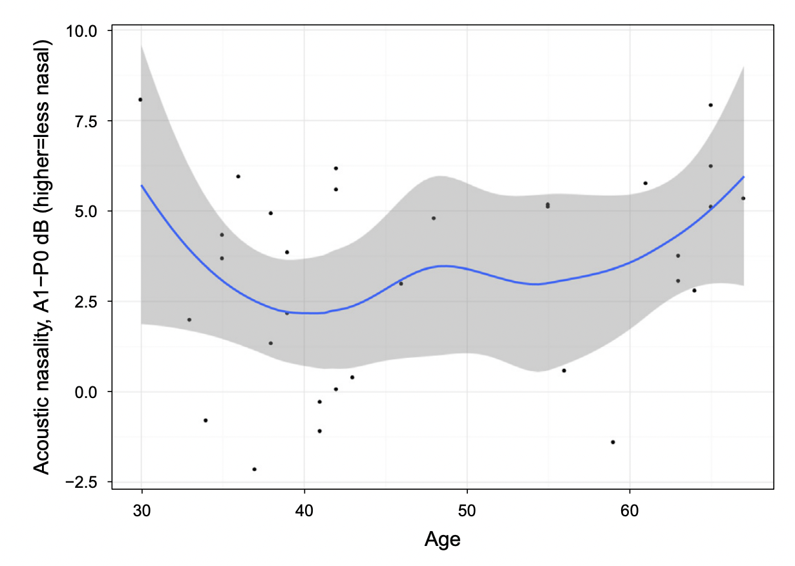
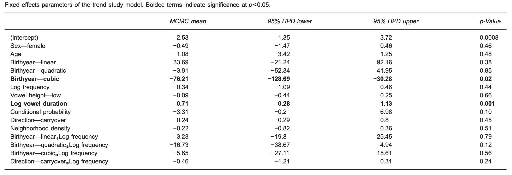
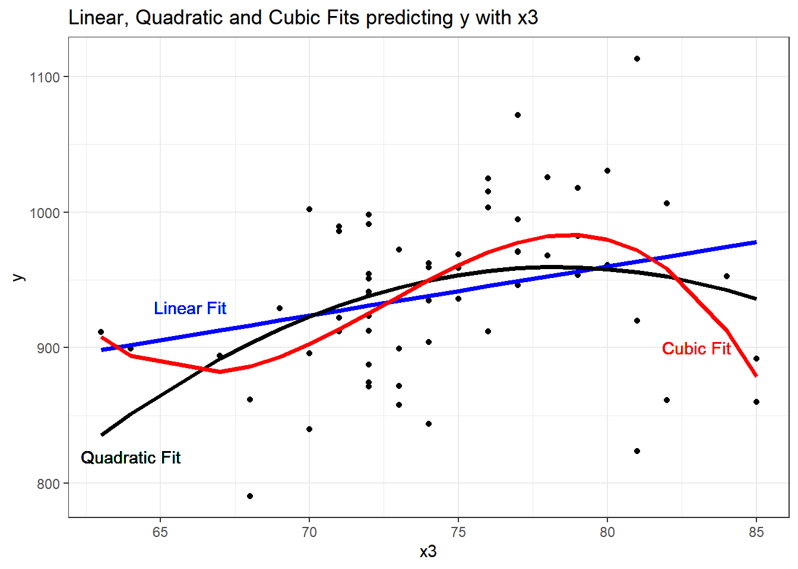

<style type="text/css">
  body{
  font-size: 12pt;
}
</style>

```{r setup, include=FALSE}
knitr::opts_chunk$set(echo = TRUE)
knitr::opts_chunk$set(dev = "png",
                      dpi = 600,
                      echo = FALSE,
                      cache = FALSE)
options(repos = list(CRAN="http://cran.rstudio.com/"))
install.packages('tidyverse') 
library(tidyverse)
```

# Nasality

Nasality refers to the acoustic consequence of the degree of velum lowering in an articulation. In the presence of a nasal consonant, adjacent vowels show lowering of the velum before (or after) the oral closure (at a particular place of articulation) for the nasal consonant. 

As the velum lowers (in VN say), the air in the nasal cavity begins to get excited and introduces high amplitude resonances into the output signal. When the oral closure occurs there are essentially two coupled "tubes" that are resonating: an oral cavity and a nasal cavity.

<p align="center">
  
</p>

The nasal cavity introduces a low frequency component called the "nasal formant" occurring around 250Hz, which can bleed into the adjacent vowels. The resonating nasal cavity has the effect of sucking out energy in certain parts of the spectrum where there is no resonance. These are called "zeros" and can be seen as areas where there is no energy. 

Below are "na" and "ana". In "ana" notice the middle portion with the nasal. The energy is gone and you can see faint formants. These are the "poles" resulting from the oral occlusion (alveolar).

<p align="center">
  
</p>

# Measurements in Zellou and Tamminga (2014)

The paper is concerned with degree of nasality on adjacent vowels as a function of time and age of the speaker in Philadelphia. The primary acoustic correlate of *nasality* is A1-P0. **A1** is the amplitude of F1 and **P0** is amplitude of the lowest nasal peak. 

<p align="center">
  
</p>

Download this file ["bad mad"](sounds/bad_mad.wav) and let's identify some of these landmarks to see how nasalization is captured. 

- First locate the midpoint of each vowel. Remember how to do this. We're looking for identificaton that the stop articulation is complete and the vowel has begun, this is signaled by periodic oscillation of the sound wave.

- The end of the vowel (in these CVCs) is where the vowel is extinguished, signaled by an abrupt end to the formant structure. You might not see the periodicity end as the final C is voiced. 

- For the nasal C "mad", the vowel is a bit harder to identify as it is preceded by a nasal which also has periodic oscillation. We'll talk about this.

- We want to be able to see lots of harmonics (as in the Zellou figure). I would recommend setting the window length for the spectrogram at 0.05s. This is a big window and so the program will be able to capture a lot of information in its reconstruction of the harmonic content of the sound.

- Go to the middle of the vowel (as they did in the paper) and examine the spectrum. Your spectrum should look something like this:

<p align="center">
  
</p>

- Examine the P0 and A1 amplitudes and take note of them. We would expect A1-P0 to be greater (i.e., less nasal) in tokens of "bad" than in "mad". But what if I'm just nasal? $\rightarrow$ what does this mean?

# Nasality in apparent time

"Apparent time", from what I understand, is sortof like a cross-sectional study. Older people are compared with younger people to see if they differ along some linguistic variable. There is a nice Wiki entry [here](https://en.wikipedia.org/wiki/Apparent-time_hypothesis). The point is to see if people in Philadelphia have changed in their degree of nasality over time. I'm not particularly interested in the research question, but I think the overall method is a good (and well worn) one.

<p align="center">
  
</p>

In the plot above, you'll notice that the individual points are overlain with a curve. This curve is the "loess" regression curve. It's a "local" regression that helps us better visualize trends in the data. This is *not* the model of the data (i.e., it's not generated in the paper by the models they've presented). Here is a nice [video](https://www.youtube.com/watch?v=Vf7oJ6z2LCc) explaining loess curves.

They've included a lot of predictors in their models, including the expected Age of the participant, birthyear, but also word frequency, vowel height (I think this was binary, low vs. mid), vowel duration (normalized using log transformation), as well as conditional probability of the nasal ("the frequency with which a segment or sequence of segments occurs in a given position in all the lexicalitems of a language"), and neighborhood density of a word ("Neighbors are defined as words that differ from the target word by the addition, deletion, or substitution of a single phoneme").

They use a Bayesian approach to modeling the data. This is beyond the scope of this course, but we'll trust them in their interpretation of the significant findings. It presents 95% confidence intervals (in Bayes terminology it's called the "credible interval") which means that there is a 95% chance that the true mean lies within the upper and lower bounds. 

<p align="center">
  
</p>

If we look at the model estimates, you see that there are two significant predictors to nasality, Birthyear (cubic) and log vowel duration. What's the "cubic"? Notice that the data are not neatly linear, that is, a line wouldn't bes model the data. What other shapes best model the actual data? There are different types of curves. The ones we see a lot of in speech analysis are "quadratic", "cubic","logistic", and "exponential". This picture shows you the general differences:

<p align="center">
  
</p>