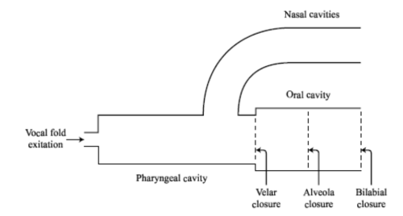
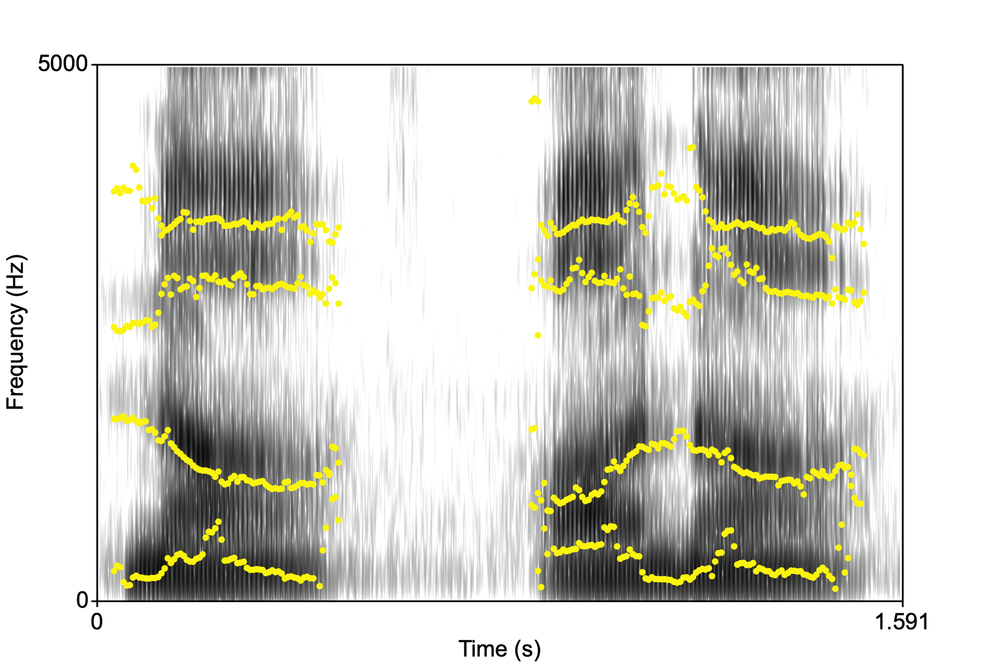
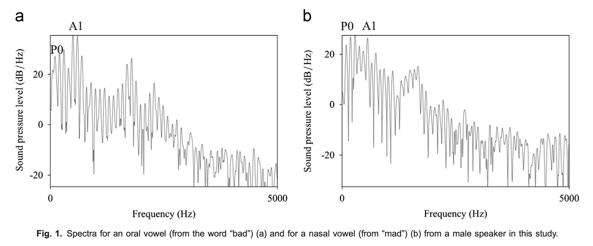
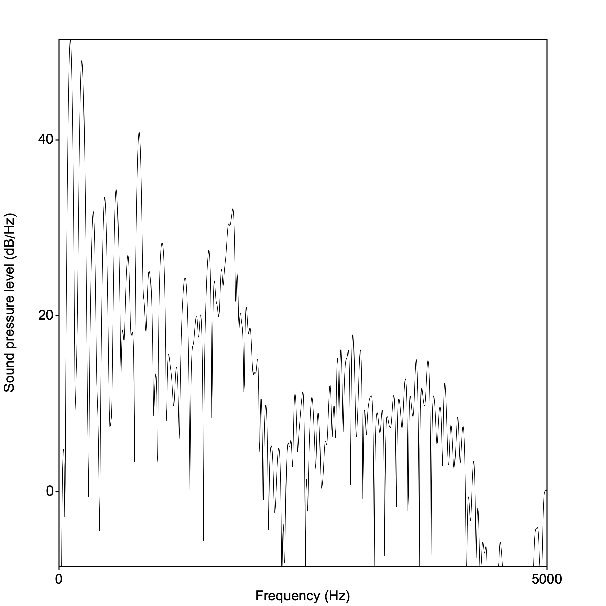

<style type="text/css">
  body{
  font-size: 12pt;
}
</style>

```{r setup, include=FALSE}
knitr::opts_chunk$set(echo = TRUE)
knitr::opts_chunk$set(dev = "png",
                      dpi = 600,
                      echo = FALSE,
                      cache = FALSE)
options(repos = list(CRAN="http://cran.rstudio.com/"))
install.packages('tidyverse') 
library(tidyverse)
```

# Nasality

Nasality refers to the acoustic consequence of the degree of velum lowering in an articulation. In the presence of a nasal consonant, adjacent vowels show lowering of the velum before (or after) the oral closure (at a particular place of articulation) for the nasal consonant. 

As the velum lowers (in VN say), the air in the nasal cavity begins to get excited and introduces high amplitude resonances into the output signal. When the oral closure occurs there are essentially two coupled "tubes" that are resonating: an oral cavity and a nasal cavity.

<p align="center">
  
</p>

The nasal cavity introduces a low frequency component called the "nasal formant" occurring around 250Hz, which can bleed into the adjacent vowels. The resonating nasal cavity has the effect of sucking out energy in certain parts of the spectrum where there is no resonance. These are called "zeros" and can be seen as areas where there is no energy. 

Below are "na" and "ana". In "ana" notice the middle portion with the nasal. The energy is gone and you can see faint formants. These are the "poles" resulting from the oral occlusion (alveolar).

<p align="center">
  
</p>

# Measurements in Zellou and Tamminga (2014)

The paper is concerned with degree of nasality on adjacent vowels as a function of time and age of the speaker in Philadelphia. The primary acoustic correlate of *nasality* is A1-P0. **A1** is the amplitude of F1 and **P0** is amplitude of the lowest nasal peak. 

<p align="center">
  
</p>

Download this file ["bad mad"](sounds/bad_mad.wav) and let's identify some of these landmarks to see how nasalization is captured. 

- First locate the midpoint of each vowel. Remember how to do this. We're looking for identificaton that the stop articulation is complete and the vowel has begun, this is signaled by periodic oscillation of the sound wave.

- The end of the vowel (in these CVCs) is where the vowel is extinguished, signaled by an abrupt end to the formant structure. You might not see the periodicity end as the final C is voiced. 

- For the nasal C "mad", the vowel is a bit harder to identify as it is preceded by a nasal which also has periodic oscillation. We'll talk about this.

- We want to be able to see lots of harmonics (as in the Zellou figure). I would recommend setting the window length for the spectrogram at 0.05s. This is a big window and so the program will be able to capture a lot of information in its reconstruction of the harmonic content of the sound.

- Go to the middle of the vowel (as they did in the paper) and examine the spectrum. Your spectrum should look something like this:

<p align="center">
  
</p>
